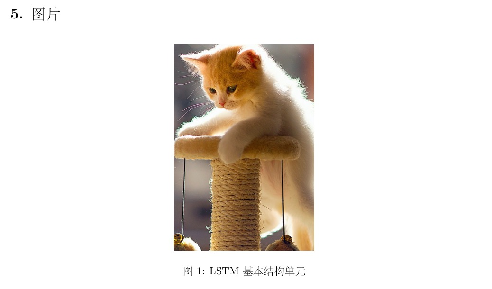
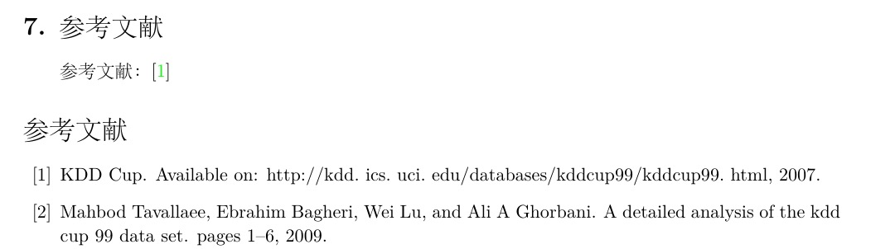

# UCAS-Homework-Latex-Template
本项目是作者自己课程作业的Latex模板，参考了[@HuangZhenyang](https://github.com/HuangZhenyang)的项目[Latex-Template-for-UCAS-Homework](https://github.com/HuangZhenyang/Latex-Template-for-UCAS-Homework)适用于个人的阅读报告、课程论文、作业等的编写。目前只添加了常用的一些内容，后续会根据我自身的实践更新，欢迎在issues提出修改意见。

# Author
- GentleCP
    - [Github](https://github.com/GentleCP)  
    - [Website](https://www.gentlecp.com)  
        > 我的个人博客，记录了我生活和学习的心得、经验
    - [CSDN](https://blog.csdn.net/GentleCP)  
        > 我的CSDN博客，发布我学习笔记

# Features
- 封面    
    
- 各级标题  
    ```text
    \section{1. 一级标题}
    \subsection{1.1 二级标题}
    \subsubsection{1.1.1 三级标题}
    ```
    
- 列表  
    ```text
    \section{2. 项目列表} 
    \subsection{2.1 无序列表}

    默认带有原点
    \begin{itemize}
        \item hello, how are you?
        \item 你好，我是cp
    \end{itemize} 
    修改原点为其他 
    \begin{itemize}
        \item[-] hello, how are you?
        \item[*] 你好，我是cp
        \item[] 消除原点
    \end{itemize} 


    \subsection{2.2 有序列表} 

    \begin{enumerate}
        \item 默认1
        \item 默认2
        \item 默认3
    \end{enumerate}

    利用无序手动更改为有序,并进行缩进
    \begin{itemize}[itemindent=1em]
        \item[(1)] 手动有序1
        \item[(2)] 手动有序2
        \item[(3)] 手动有序3
    \end{itemize} 
    与上间距
    \begin{itemize}[itemindent= 15 pt]
        \item[step 1] 手动有序1
        \item[step 2] 手动有序2
        \item[step 3] 手动有序3
    \end{itemize} 
    更多间距调整内容参考\href{https://blog.csdn.net/robert_chen1988/article/details/83179571}{latex 列表间距修改} 
    ```
    
- 公式  
    ```text
    \section{3. 公式}
    \subsection{3.1 无编号公式}

    多行公式
    \[
    \begin{split}
    n^2 + n + 1 &=
    \\
    &\leq n^2 + n^2 + n^2
    \\
    &= 3n^2
    \\
    &\leq c \cdot 2n^3
    \end{split}
    \]
    行内公式

    后面是个公式\(f(n) = n^2 + n + 1\), \(g(n) = 2n^3\)

    \subsection{3.2 带编号公式}
    \begin{equation}
    \begin{split}
    z_o = \sigma(W_o*(x_t,h_{t-1}))\\
    z_f = \sigma(W_f*(x_t,h_{t-1}))\\
    z_i = \sigma(W_i*(x_t,h_{t-1}))\\
    z = \tanh(W*(x_t,h_{t-1}))
    \end{split}
    \end{equation}
    ```
    
- 代码  
    ```text
    \section{4. 代码}
    \begin{lstlisting}[language = python, numbers=left, 
    numberstyle=\tiny,keywordstyle=\color{blue!70},
    commentstyle=\color{red!50!green!50!blue!50},frame=shadowbox,
    rulesepcolor=\color{red!20!green!20!blue!20},basicstyle=\ttfamily]

    # 这是注释
    def test():
      pass

    \end{lstlisting}
    ```
     
- 图片  
    ```text
    \section{5. 图片} 
    \begin{figure}[H]
        \centering
        \includegraphics[width=0.3\linewidth]{images/test-fig.png}
        \caption{LSTM基本结构单元}
        \label{fig:LSTM基本结构单元}
    \end{figure}
    ```
    
- 表格  
    ```text
    \section{6. 表格} 
    算法
    \begin{algorithm}[H]
        \begin{algorithmic}[1] %每行显示行号
            \Require{Positive Instance Set $ P $, Unlabeled Instance Set $ U $ , Sample Ratio s.}
            \Ensure{Reliable Negative Instance Set $ RN $.}
            
            \State{$set  RN = \emptyset $}
            \State{Sample $ s $ of the instances from $ P $ as $ S $}
            \State{Set $ P_s  = P − S$ with label $ 1 $, $ U_s = U \cup S $ with label $ -1 $}
            \State{Train a classifier $ g $ with $ P_s $ and $ U_s $}
            \State{Classify instances in $ U $ using $ g $, output the class-conditional-probability}
            \State{Select a threshold $ \theta $ according to the class-conditional-probability of
                instances in $ S $}
            \For{$ d \in U $ do}
            \If{$ Pr(1|d) \leq \theta, RN = RN \cup d $}
            \EndIf
            \EndFor
            \State{Output RN}
        \end{algorithmic}
        \caption{Reliable Negative Instances Selection}
        \label{alg:Reliable Negative Instances Selection}
    \end{algorithm}

    表格1 

    \begin{tabular}{|c|c|c|c|}
        \hline 
        方法 & 特点 & 优点 & 缺点  \\ 
        \hline 
        有监督学习 & \tabincell{c}{对数据进行标注，\\ 通过有监督学习的方式\\ 来检测恶意URL} & 更强的泛化能力 & \tabincell{l}{现实生活中很难获得\\ 精准的标注数据。\\ 在更多时候，我们可能\\ 只得到一小部分恶意URL\\ 和大量未标记的URL样本，\\ 缺乏足够可靠的负例样本} \\ 
        \hline 
        无监督学习 & 不需要对数据进行标注 & 无需标注的数据即可进行训练 & \tabincell{c}{已知恶意URL的标注信息\\ 就难以充分利用，可能\\ 无法达到令人满意的识别能力} \\
        \hline
    \end{tabular}  

    表格2

    \begin{tabular}{ccc}
        \hline
        姓名& 学号& 性别\\
        \hline
        Steve Jobs& 001& Male\\
        Bill Gates& 002& Female\\
        \hline
    \end{tabular}

    表格3带编号
    \begin{table}[ht]
        \caption{表格哈哈哈哈}
        \centering
        \begin{tabular}{c || c | c | c | c | c}
            & \(x \mod 5 = 0\)
            & \(x \mod 5 = 1\)
            & \(x \mod 5 = 2\)
            & \(x \mod 5 = 3\)
            & \(x \mod 5 = 4\)
            \\
            \hline
            \(x0\) & 0 & 2 & 4 & 1 & 3 \\
            \(x1\) & 1 & 3 & 0 & 2 & 4 \\
        \end{tabular}
    \end{table}


    更多表格样式参考：\href{https://www.jianshu.com/p/35abc6772576}{表格样式} 
    ```
    
     
- 参考文献  
    ```text
    \section{7. 参考文献}
    参考文献：\cite{cup2007available} 
    ```
    

# Usage
> 使用本项目前，请自行安装完成tex的环境部署，详细方案网上有许多教程，此处不多赘述。
1. 克隆本项目到本地
    ```text
    git clone https://github.com/GentleCP/UCAS-Homework-Latex-Template.git
    ```
2. 使用`ide`打开`homework.tex`  
    > 推荐使用texstudio,免费且跨平台  
3. 修改封面，标题，添加正文  
    封面标题在`homework.sty`文件中，很容易发现，修改成对应自己想要的即可，
    logo图片将图片放到images目录下再修改。正文部分有注释标明，仔细找找即可。

# Contact
- dongchaopeng@iie.ac.cn
- 574881148@qq.com
    
# Acknowledgement
- [@HuangZhenyang](https://github.com/HuangZhenyang)